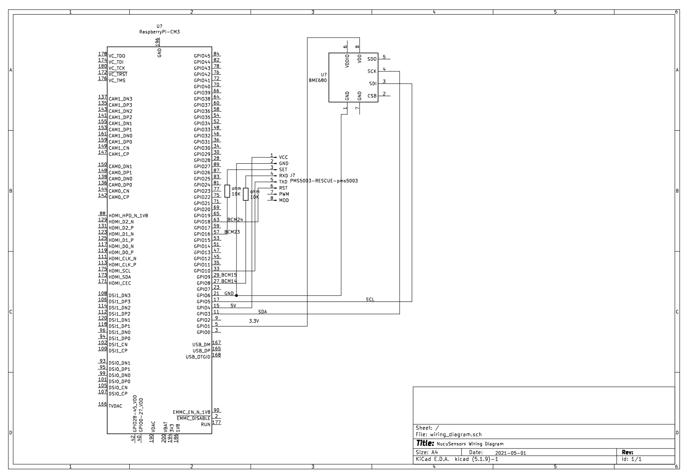

# Introduction

This module will read sensors data periodically and
provide access to it via gRPC, while optionally publishing telemetry data into the cloud.

For installing see instructions from the Readme.md file located at the root directory.

# Wiring

_You may download the Kicad diagrams from `Docs/kicad/`._

Wire your sensor according to the following diagram:



#### BME680

Connect the BME680 sensor to the I2C bus 1 (I2C.1) of the Raspberry Pi.
The address ` 0x76` will be used to communicate with the sensor.

Make sure I2C is enabled. Use `raspi-config`.

#### PMS5003

Make sure to enable the serial hardware via `raspi-config`. Interfacing Options > Serial and disable the login shell and enable the serial port hardware.
Then edit `/boot/config.txt` file and add `enable_uart=1` and `dtoverlay=pi3-miniuart-bt` to the bottom.

SENSOR 1 (VCC) -> RPI 5V
SENSOR 2 (GND) -> RPI Ground
SENSOR 3 & 6 (SET & RESET) -> 10k OHM -> RPI 3.3V
SENSOR 4 (RXD) -> RPI Gpio 14 (UART TX)
SENSOR 6 (TXD) -> RPI Gpio 15 (UART RX)

# Configuration

Each Sensor is configured via the `appsettings.json` file. The following configuration options are
available to all sensors:

- Enabled: (bool) Enables or disables the sensor.
- Telemetry: (bool) Enables or disables telemetry reporting for the sensor.
- Grpc: (bool): Enables or disables the gRPC endpoint for the sensor.
- MeasurementInterval: (int) The interval in milliseconds in which the sensor will read data. Default: 3000

---
Besides sensor configuration, you may also configure the telemetry service. The telemetry service collects telemetry data from all sensors
and uses a telemetry publisher to publish the data.

Example config:
```
{
    "Telemetry": {
        "Publisher": "Disk",
        "ServiceEnabled": true,
        "PublishInterval": 3000,
        "ConnectionString": "FileName=nucucar.telemetry;FileExtension=txt;Separator=\n"
    },
    "EnvironmentSensor": {
        "Enabled": true,
        "Telemetry": true,
        "Grpc": true
    },
}
```

---

# Sensors

#### Environment Sensor

We use [BME680](https://www.bosch-sensortec.com/bst/products/all_products/bme680) environmental sensor from Bosh.

Sensor capabilities:

* Temperature
* Barometric Pressure
* Humidity
* VOC Gas (Gas Resistance)