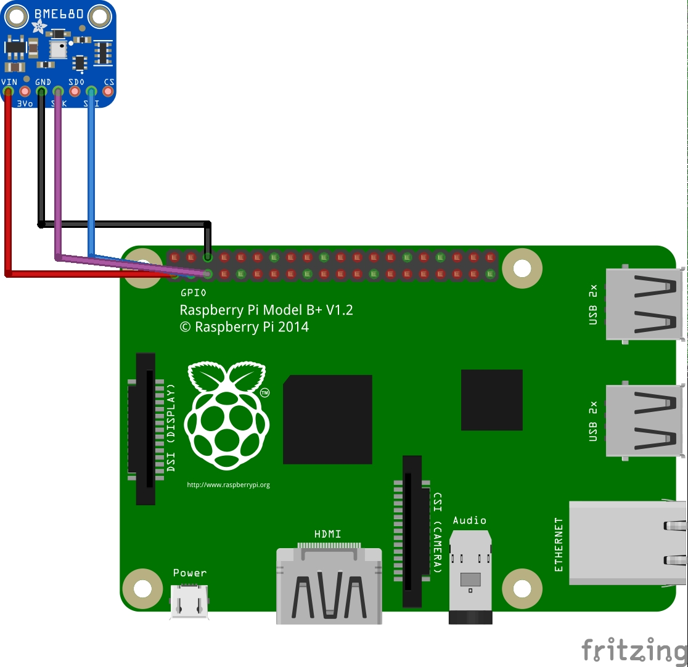

This application will read sensors data periodically,
provide access to it via gRPC and publish telemetry to the cloud.

## Installation How-To

1. Build the module and target the Raspberry Pi.
2. Copy the files over to the Raspberry Pi.
3. Modify `appsettings.json` to fit your needs.
4. Install the hardware.

### Wiring

You may download the Fritzing diagram from `Docs/fritzing/nucucar.sensors.fzz` 
in order to play with it.

#### BME680

Connect the BME680 sensor to the I2C bus 1 (I2C.1) of the Raspberry Pi. 
The address ` 0x76` will be used to communicate with the sensor.
 

5\. Run the application.

### Environment Sensor

Worker service for the [BME680](https://www.bosch-sensortec.com/bst/products/all_products/bme680) environmental sensor from Bosh.

Sensor capabilities:

* Temperature
* Barometric Pressure
* Humidity
* VOC Gas (Gas Resistance)