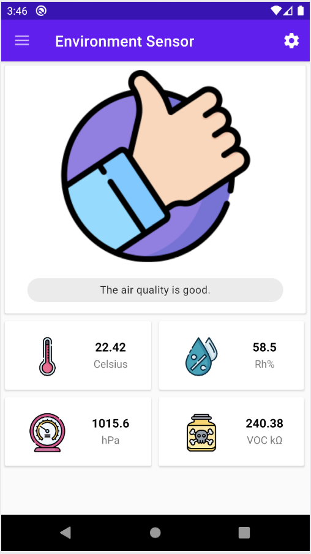

# Introduction

This package holds the code for the NucuCar.Android companion application.

The purpose of the application is to allow the user to interact with the NucuCar system via the mobile phone.

